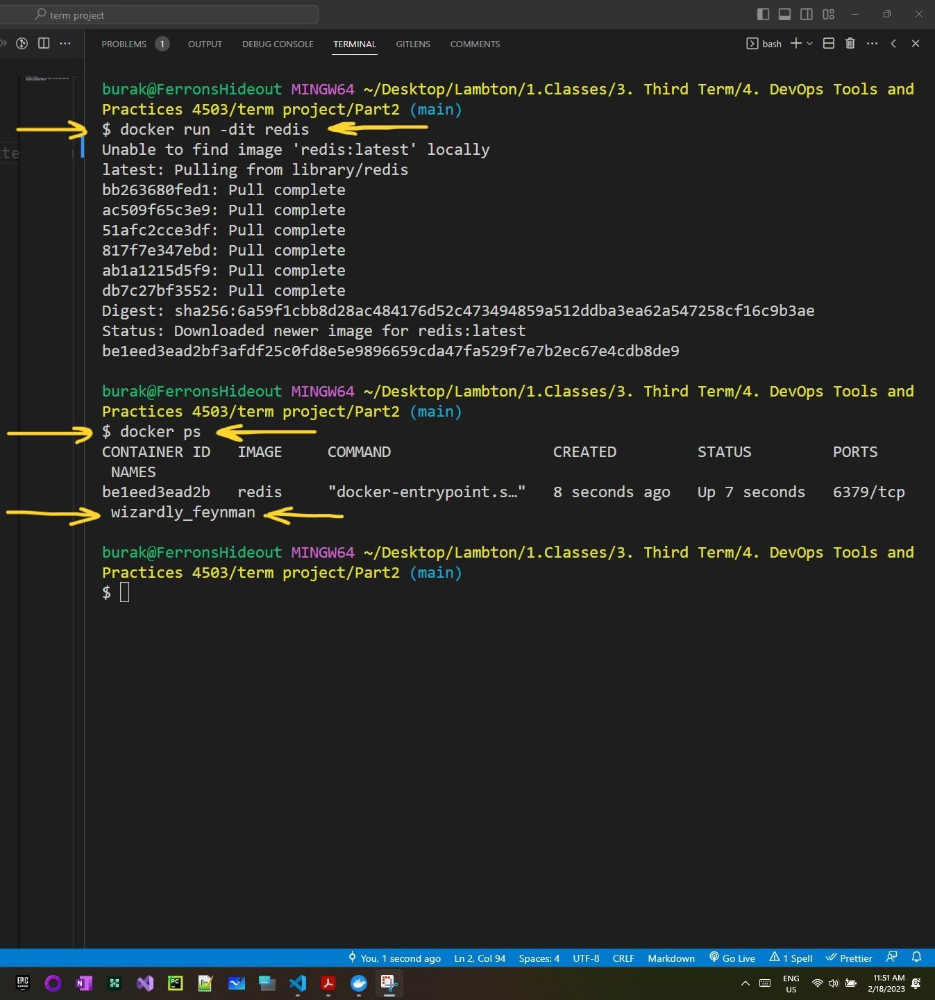
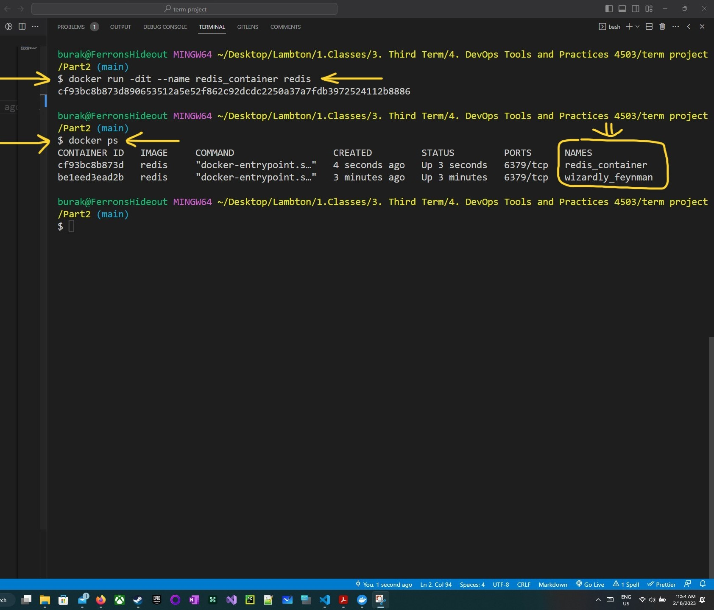
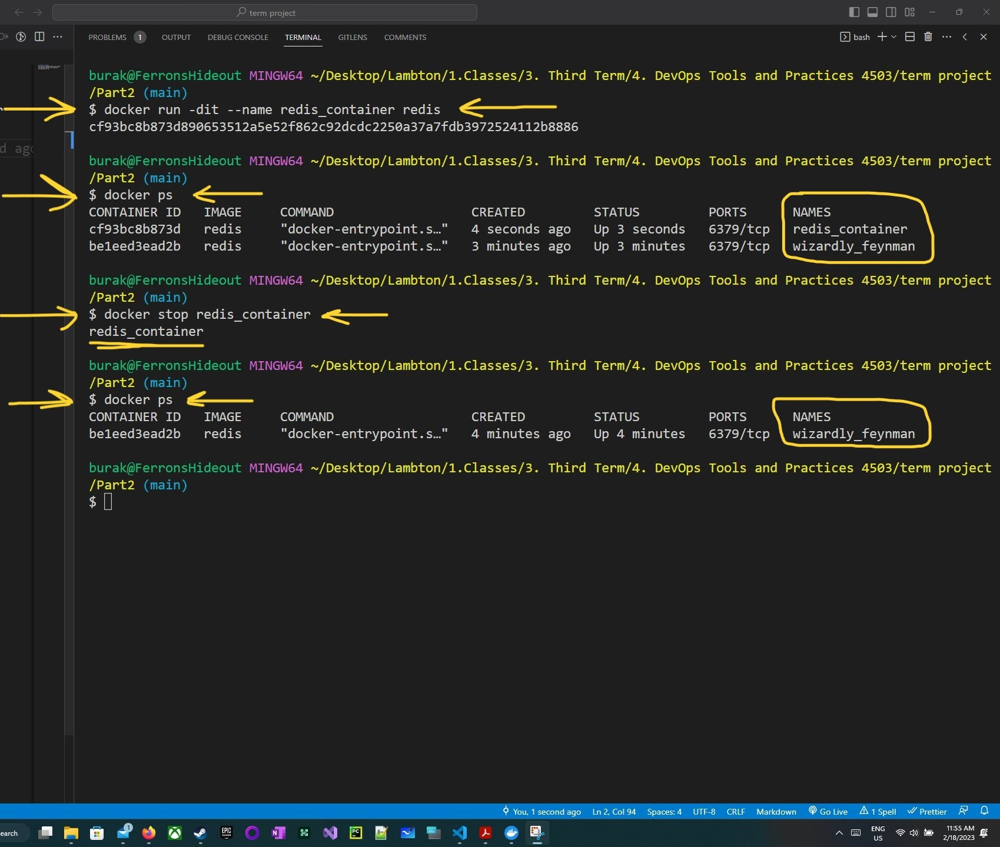
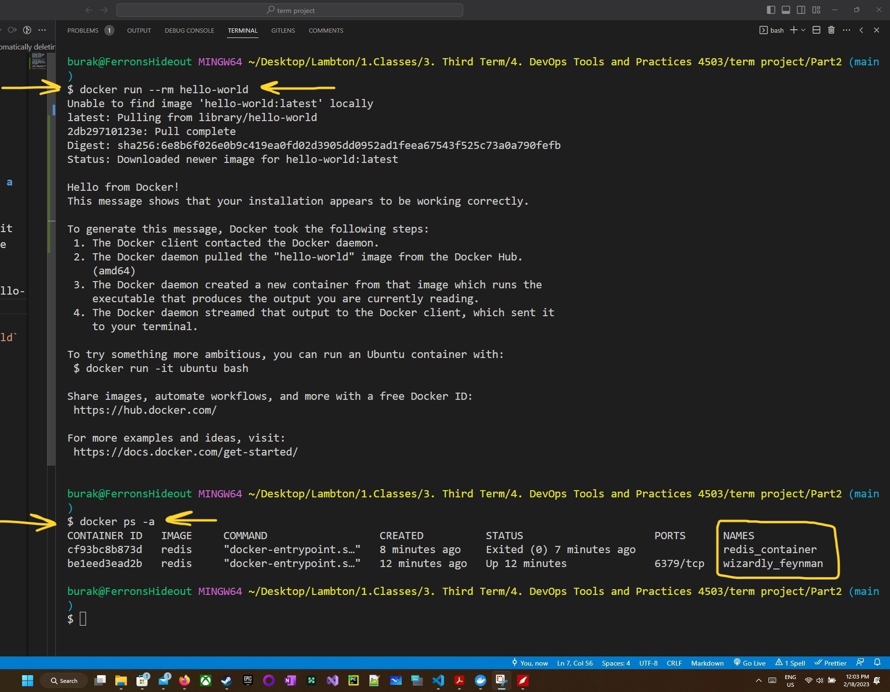
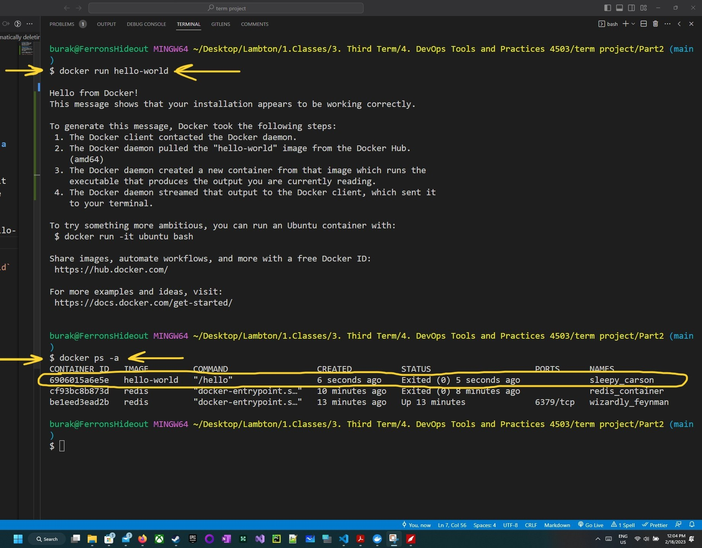
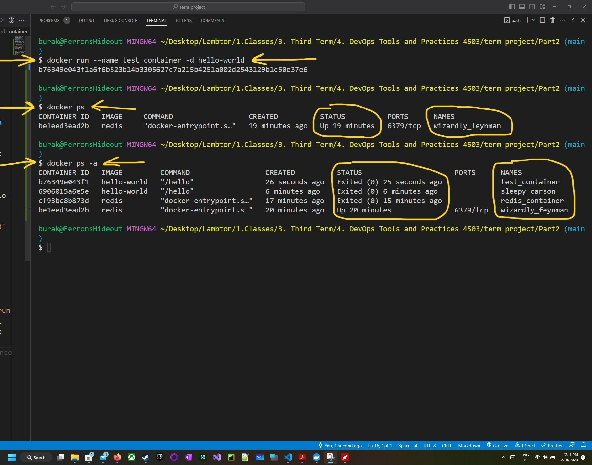
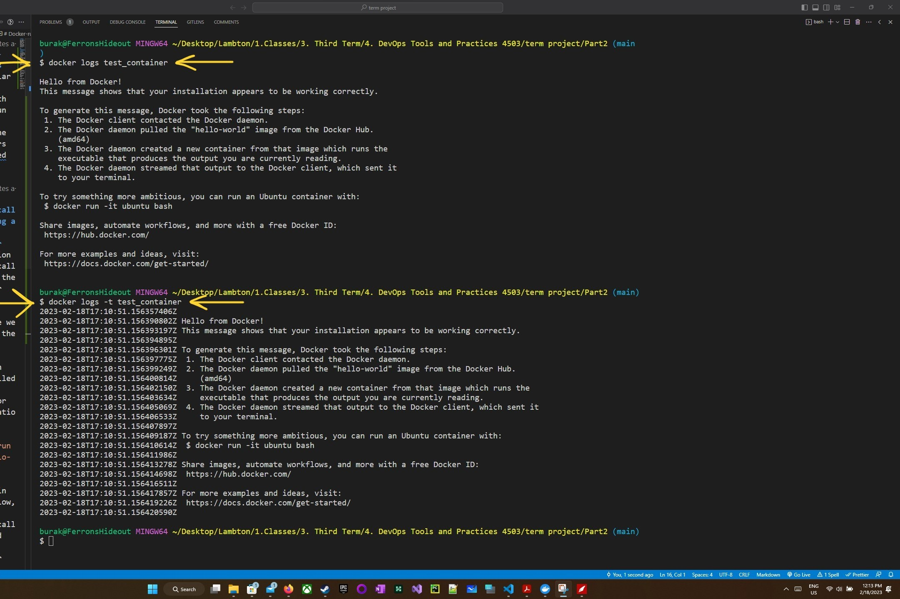

# Docker-run-Redis
Run popular database Redis with docker run and than delete the containers associated with it.

### Start the container
I started a container using

`docker run -dit redis` command.

Then I used

`docker ps` command to see the containers.

If you want to give a specific name to a container than you should use the below command

`docker run -dit --name redis_container redis`

### Stop the container
In order to stop the container we will use the below command

`docker stop redis_container`

### Automatically deleting a stopped container
--rm option automatically delete the container once it stops therefore we will use the command

I used an image called "hello-world" for demonstration.

`docker run --rm hello-world`

As seen in image below, it automatically deleted the container once it stops

However, if we use `docker run hello-world` command it will not automatically delete the container

### Docker log command to see the logs
The default command for log is 

`docker logs CONTAINER_NAME`

where CONTAINER_NAME is the name of your container.

I used 

`docker run --name test_container -d hello-world`

command to create a container test_container from hello-world image.

To see the logs we should use 

`docker logs test_container` command

In order to display the output with timestamps than we use

`docker logs -t test_container` command.

